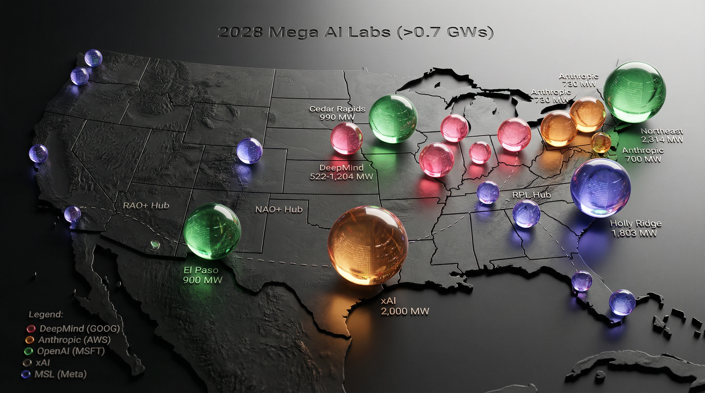

# pta-portfolio

The source of **[pta-portfolio.vercel.app](https://pta-portfolio.vercel.app)** —
Patrick Anderson's portfolio: a 48-piece filterable gallery, six hand-built case
studies, a detail page for every piece, and a live in-page interactive rendered
from generated data. React 19, TypeScript, Vite 7, Tailwind 4, wouter. Static
build, no backend, deployed on Vercel.

This is a public link on a résumé, so the constraint that shapes the codebase is
that **anything wrong here is wrong in front of an employer**. Career facts live in
exactly one file, accents are derived rather than authored, card labels come from a
controlled vocabulary, and the sitemap generator refuses to emit if it parses zero
project ids.



---

## What's in it

| | |
|---|---|
| Gallery pieces | 48, across 6 domains |
| Layouts | 4, switchable |
| Filter facets | 3 — industry × technique × format |
| Case studies (`/work/:slug`) | 6, hand-built |
| Long-form narratives | 22 of 48 |
| Live in-page interactives | 1 (the chronological Sankey) |
| Routes in the sitemap | 59 |

### Routes

| Path | What |
|---|---|
| `/` | Landing — four sections |
| `/projects` | The gallery. **View state lives in the query string** — layout, all three facets and sort order, so `?industry=environmental` is a shareable link |
| `/projects/:id` | A detail page for every piece: macro stack, plus a long-form narrative where one exists |
| `/work/:slug` | The six hand-built dashboard case studies |
| `/about`, `/resume`, `/contact` | |
| `/work`, `/journey` | Redirect to `/projects` — retired routes kept alive |

---

## The conventions that keep it correct

These are load-bearing. Breaking one produces a plausible-looking page that is
quietly wrong.

- **Career facts live in one file.** `CareerTimeline.tsx` holds roles, dates and
  per-role highlights; `/about` and `/resume` both read from it. Two copies drift,
  and this data has drifted before.
- **`accent` is derived from `domain`, never authored per piece.** Thirty-three of
  forty-seven had drifted before it was derived.
- **Card labels are `<Domain> · <Subtype>` from a controlled `SubtypeKey` union.**
  The type makes new entries declare `tech` and `interactive` too.
- **The canonical is set per route from the current location.** With no SSR, one
  static canonical in `index.html` tells a crawler that all 48 piece pages are
  duplicates of the homepage — worse than having none.
- **`prefers-reduced-motion` is honoured in six components, not in CSS.** Framer
  Motion writes transforms as inline styles, and an inline style outranks any
  stylesheet rule. A missed branch on the `/projects` layout swap left a
  42,763px block of 48 cards at opacity 0.
- **The Sankey's focus dimming is one generated stylesheet, not a re-render.**
  Geometry renders once and is held by reference; focus is deliberately absent
  from the memo dependencies. 96–199 ms and 3,056 DOM mutations became 4.3 ms and
  5–8.
- **`description` renders in only two places** — the Editorial layout, and as the
  fallback body on a piece with no narrative. Check where a field surfaces before
  verifying a change to it.

---

## Getting started

**This project uses pnpm.** `npm install` will produce a lockfile that does not
match and is not what CI or Vercel resolves.

```bash
pnpm install
pnpm dev
```

```bash
pnpm check
```

```bash
pnpm build
```

`build` runs `scripts/build-sitemap.mjs` before `tsc` and `vite build`, generating
`robots.txt` and a 59-url `sitemap.xml` from `projects.ts`. It exits non-zero
rather than emitting an empty sitemap.

---

## Generated data

The chronological Sankey's data is **generated, not hand-edited**:

```bash
node scripts/build-chrono-sankey.mjs
```

It reads `data/chrono-sankey/reading-plan.tsv` — the printed Daily Reading Index,
transcribed — and refuses to emit unless the plan still covers all 66 books
exactly once. Current output: 365 days, 767 readings, 1,397 atoms, 31,102 verses,
zero overlaps.

Edit the TSV, re-run the script. Never edit the output.

---

## Project layout

```
src/
  lib/
    projects.ts      the 48 pieces — the single source for the gallery,
                     the sitemap and the piece detail pages
    narratives.ts    long-form write-ups keyed by piece id; 22 of 48
    livePieces.tsx   piece id -> lazily-loaded interactive component.
                     Adding an interactive is one line here.
    data/            generated datasets (chrono Sankey)
  pages/
    Projects.tsx     gallery: 4 layouts, 3 facets, sort, URL state
    PieceDetail.tsx  /projects/:id — generic, driven by PROJECTS
    ProjectDetail.tsx  /work/:slug — the 6 hand-built case studies
    About, Resume, Contact, Home
  components/
    CareerTimeline.tsx   THE career data file. Roles, dates, highlights.
scripts/
  build-sitemap.mjs        robots.txt + sitemap.xml at build time
  build-chrono-sankey.mjs  Sankey data; validates 66-book coverage
data/chrono-sankey/        the transcribed reading plan (source of truth)
```

---

## Limits

**No SSR.** It is a static SPA, so social crawlers see one `index.html`. The
per-route canonical mitigates the duplicate-content problem; it does not give
each piece its own Open Graph card.

**Images have no `srcset`.** 179 WebPs, 32 MB, 23 of them over 400 KB. One asset
renders at 552 CSS px from a 3168px source — roughly twenty times the pixels a
375px phone needs. This is the largest known unfixed performance issue.

**The vercel.app host is hardcoded in four places** — `index.html`'s og/twitter
tags, `scripts/build-sitemap.mjs`, and `src/App.tsx`. Grep the host before moving
to a custom domain; do not trust a comment to list them all.

**26 of 48 pieces have no long-form narrative.** They render `method` and
`insight` only, which is a shorter page rather than a broken one.

**A clean `tsc` is not a check.** A temporal dead zone error typechecked green and
rendered a blank page. Load the pages.

---

## Design system

"Forged Monolith" — dark-default neumorphic with a warm parchment light theme.
Cinzel for display, Lora for body, Cormorant Garamond for editorial, Space Mono
retained for the telemetry and data-readout register. Textures are zoned by role
deliberately; surfaces are raised, pressed or concave with directional bevel
lighting.

**Inline styles beat media queries, `:hover` and the theme.** That ordering has
caused real bugs here and is worth remembering before reaching for one.
